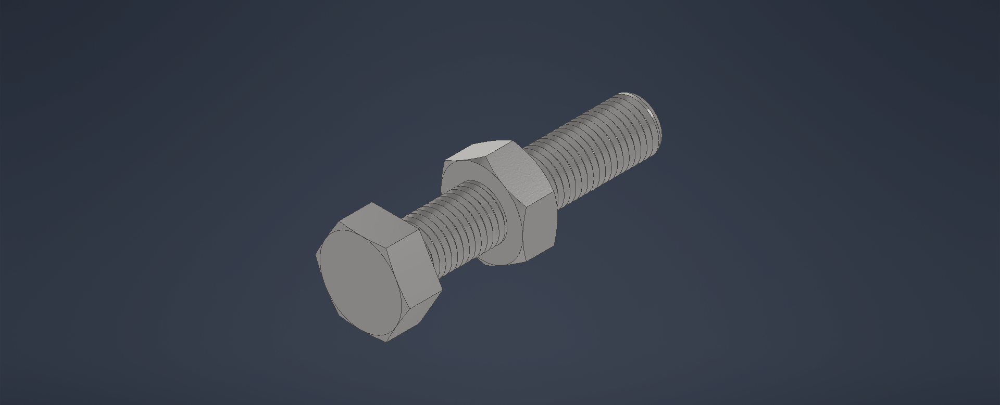

# cad-portfolio
CAD projects using Autodesk Inventor

This repository contains selected CAD projects created using
Autodesk Inventor. These projects focus on part modelling, assemblies,
and basic mechanical mechanisms.

## Skills
- Part modelling and assemblies (Autodesk Inventor)
- Constraint-based design
- Mechanical mechanisms and structures

## Projects

### Vice Bench Assembly
- Designed a vice bench assembly including screw mechanism and jaws
- Focus on component interaction and constrained assemblies
- 

- Modelled a vice bench assembly including base, jaws, screw mechanism, and handle
- Focus on part modelling, assembly constraints, and component interaction
- Created as a learning project to understand mechanical assemblies

### Geneva Mechanism
- Designed and assembled a Geneva mechanism to study intermittent motion
- Focus on kinematic constraints and motion transfer

### Nut and Bolt Assembly
- Standard fastener modelling and assembly
- Understanding of mechanical fastening and fits
  
- Modelled standard nut and bolt components
- Focus on part modelling, threading concept, and mechanical fastening

### Basic Airplane Model
- Conceptual airplane CAD model
- Focus on structural layout and component placement
  

- Conceptual airplane CAD model
- Focus on overall structure and component layout

Note: Some assemblies are conceptual and created for learning purposes.
