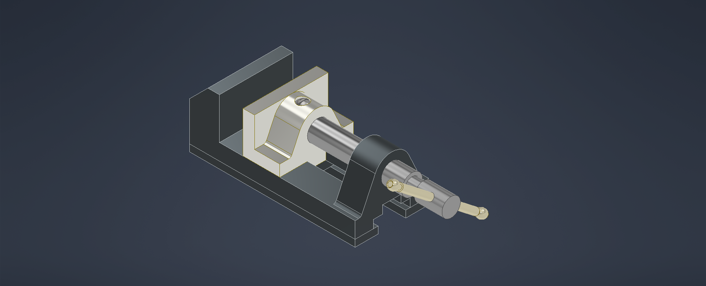
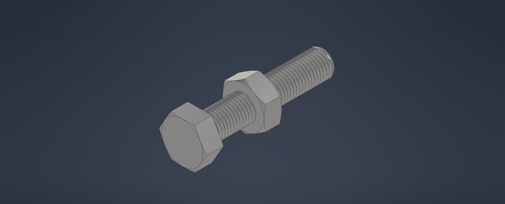

# CAD Portfolio
CAD projects using Autodesk Inventor

This repository contains selected CAD projects created using Autodesk Inventor. These projects focus on part modelling, assemblies, mechanisms, and parametric design.

## Skills
- Part modelling and assemblies (Autodesk Inventor)
- Constraint-based design
- Parametric modelling
- Top-down assembly design
- Mechanical mechanisms and structures

## Projects

### Vice Bench Assembly

- Modelled a vice bench assembly including base, jaws, screw mechanism, and handle
- Focus on part modelling, assembly constraints, and component interaction
- Created as a learning project to understand mechanical assemblies

### Nut and Bolt Assembly

- Modelled standard nut and bolt components
- Focus on part modelling, threading concepts, and mechanical fastening
- Understanding of standard fasteners and fits

### Basic Airplane Model

- Conceptual airplane CAD model
- Focus on overall structure and component layout
- Created to explore basic modelling and design concepts

### Geneva Mechanism (Ongoing)

- Designed and assembled a Geneva mechanism
- Demonstrates intermittent motion and kinematic constraints
- Focus on motion transfer and mechanism design

### Robot Assembly

- Designed a robot assembly using parametric top-down design methodology
- Focus on assembly planning, constraints, and component relationships
- Demonstrates parametric modelling and structured assembly workflow

## Note
Some assemblies are conceptual and created for learning purposes.
